<div align="center">

# 🧬 Smart Bio GPT

### *AI-Powered Biomedical Research Assistant*

<p align="center">
  
</p>

[](https://smart-bio-gpt-tau.vercel.app)
[](https://github.com/saiprasad367/SmartBioGPT)
[](https://github.com/saiprasad367/SmartBioGPT)
[](LICENSE)


</div>

---

## 🎯 Overview

**Smart Bio GPT** is a cutting-edge full-stack web application that revolutionizes the way researchers interact with gene and protein data. Using a conversational ChatGPT-style interface, it combines secure authentication, AI-powered insights, real-time biomedical data retrieval, and stunning 3D protein visualization.

<div align="center">

### 🚀 **[Launch App →](https://smart-bio-gpt-tau.vercel.app)**

</div>

### 📊 Project Stats

<div align="center">

<table>
<tr>
<td align="center" width="25%">

<br><strong>10,000+</strong>
<br>Lines of Code
</td>
<td align="center" width="25%">

<br><strong>5+</strong>
<br>External APIs
</td>
<td align="center" width="25%">

<br><strong>TypeScript</strong>
<br>Primary Language
</td>
<td align="center" width="25%">

<br><strong>Live</strong>
<br>Production Ready
</td>
</tr>
</table>

</div>

---

## 🏗️ System Architecture


---

## ✨ Key Features

<table>
<tr>
<td width="50%">

### 🔐 **Secure Authentication**
JWT-based user registration and login system with encrypted password storage

</td>
<td width="50%">

### 💬 **AI-Powered Chat**
Natural language interface for biological queries with intelligent responses

</td>
</tr>
<tr>
<td width="50%">

### 🔬 **Gene & Protein Search**
Multi-source biomedical data aggregation from leading databases

</td>
<td width="50%">

### 🧪 **3D Protein Visualization**
Interactive molecular structure rendering with Three.js and Mol*

</td>
</tr>
<tr>
<td width="50%">

### ⭐ **Favorites & History**
Save and track your research queries for easy reference

</td>
<td width="50%">

### 📱 **Responsive Design**
Seamless experience across mobile, tablet, and desktop devices

</td>
</tr>
</table>

<div align="center">
  
</div>

---

## 🛠️ Tech Stack

<div align="center">

### Frontend Technologies


### Backend Technologies


### Deployment & Tools


</div>

### 📊 Language Distribution


---

## 📁 Repository Structure

```
📦 SmartBioGPT
┣ 📂 bio-insight-ai-main          # 🎨 Frontend Application
┃ ┣ 📂 src
┃ ┃ ┣ 📂 components               # React components
┃ ┃ ┣ 📂 pages                    # Application pages
┃ ┃ ┣ 📂 hooks                    # Custom React hooks
┃ ┃ ┣ 📂 utils                    # Utility functions
┃ ┃ ┣ 📂 styles                   # CSS and Tailwind styles
┃ ┃ ┗ 📂 assets                   # Images and static files
┃ ┣ 📜 package.json
┃ ┣ 📜 vite.config.ts
┃ ┣ 📜 tsconfig.json
┃ ┗ 📜 tailwind.config.js
┃
┣ 📂 backend                      # ⚙️ Backend API
┃ ┣ 📂 src
┃ ┃ ┣ 📂 routes                   # API endpoints
┃ ┃ ┣ 📂 controllers              # Request handlers
┃ ┃ ┣ 📂 models                   # Database models
┃ ┃ ┣ 📂 middleware               # Auth & validation
┃ ┃ ┣ 📂 services                 # Business logic
┃ ┃ ┗ 📂 utils                    # Helper functions
┃ ┣ 📜 package.json
┃ ┗ 📜 .env.example
┃
┣ 📜 .gitignore
┗ 📜 README.md
```

<div align="center">
  
</div>

---

## 🚀 Local Setup

### 📋 Prerequisites

<table>
<tr>
<td width="33%">

**Node.js**
```bash
v16 or higher
```

</td>
<td width="33%">

**Supabase**
```bash
PostgreSQL Database
```

</td>
<td width="33%">

**Git**
```bash
Version Control
```

</td>
</tr>
</table>

### 1️⃣ Clone the Repository

```bash
git clone https://github.com/saiprasad367/SmartBioGPT.git
cd SmartBioGPT
```

<div align="center">
  
</div>

### 2️⃣ Backend Setup

Navigate to the backend directory:

```bash
cd backend
npm install
```

Create a `.env` file in the `backend/` directory:

```env
# Database Configuration
SUPABASE_URL=your_supabase_project_url
SUPABASE_KEY=your_supabase_anon_key
DATABASE_URL=your_postgresql_connection_string

# Authentication
JWT_SECRET=your_jwt_secret_key

# Server Configuration
PORT=5000
NODE_ENV=development

# External APIs (Optional)
UNIPROT_API_KEY=your_uniprot_key
DRUGBANK_API_KEY=your_drugbank_key
```

Start the backend server:

```bash
npm run dev
```

✅ Backend running on `http://localhost:5000`

<div align="center">
  
</div>

### 3️⃣ Frontend Setup

Navigate to the frontend directory:

```bash
cd bio-insight-ai-main
npm install
```

Create a `.env` file in the `bio-insight-ai-main/` directory:

```env
# API Configuration
VITE_API_BASE_URL=http://localhost:5000

# Supabase Configuration (for client-side)
VITE_SUPABASE_URL=your_supabase_project_url
VITE_SUPABASE_ANON_KEY=your_supabase_anon_key
```

Start the frontend development server:

```bash
npm run dev
```

✅ Frontend running on `http://localhost:5173`

<div align="center">
  
</div>

### 🎉 You're All Set!

Open your browser and navigate to `http://localhost:5173`

---

## 🌐 Production Deployment

<table>
<tr>
<td width="50%">

###  Backend on Render

1. **Connect Repository**
   - Link your GitHub repository to Render

2. **Configure Settings**
   - Set root directory: `backend/`
   - Build command: `npm install`
   - Start command: `npm start`

3. **Environment Variables**
   ```
   SUPABASE_URL=your_supabase_url
   SUPABASE_KEY=your_supabase_key
   DATABASE_URL=your_database_url
   JWT_SECRET=your_jwt_secret
   PORT=5000
   NODE_ENV=production
   ```

4. **Deploy** 🚀

</td>
<td width="50%">

###  Frontend on Vercel

1. **Connect Repository**
   - Link your GitHub repository to Vercel

2. **Configure Settings**
   - Root directory: `bio-insight-ai-main/`
   - Framework: Vite
   - Build command: `npm run build`
   - Output directory: `dist`

3. **Environment Variables**
   ```
   VITE_API_BASE_URL=https://your-backend.onrender.com
   VITE_SUPABASE_URL=your_supabase_url
   VITE_SUPABASE_ANON_KEY=your_supabase_key
   ```

4. **Deploy** 🚀

</td>
</tr>
</table>

<div align="center">

### 🔄 Deployment Workflow

```mermaid
graph LR
    A[💻 Local Development] -->|git push| B[📦 GitHub Repository]
    B -->|Auto Deploy| C[🌐 Vercel Frontend]
    B -->|Auto Deploy| D[⚙️ Render Backend]
    D -->|Connect| E[🗄️ Supabase DB]
    
    style A fill:#FFE66D,stroke:#FFD700,stroke-width:2px,color:#000
    style B fill:#6E5494,stroke:#5C4379,stroke-width:2px,color:#fff
    style C fill:#000000,stroke:#333333,stroke-width:2px,color:#fff
    style D fill:#46E3B7,stroke:#2DA771,stroke-width:2px,color:#000
    style E fill:#3ECF8E,stroke:#2DA771,stroke-width:2px,color:#000
```



</div>

---

## 🔌 API Endpoints

<div align="center">

### Base URL: `https://your-backend.onrender.com/api`

</div>

<table>
<tr>
<th width="15%">Method</th>
<th width="30%">Endpoint</th>
<th width="40%">Description</th>
<th width="15%">Auth Required</th>
</tr>

<tr>
<td align="center">

</td>
<td><code>/auth/register</code></td>
<td>Register a new user account</td>
<td align="center">❌</td>
</tr>

<tr>
<td align="center">

</td>
<td><code>/auth/login</code></td>
<td>Login user and receive JWT token</td>
<td align="center">❌</td>
</tr>

<tr>
<td align="center">

</td>
<td><code>/bio/search</code></td>
<td>Search for gene and protein data</td>
<td align="center">✅</td>
</tr>

<tr>
<td align="center">

</td>
<td><code>/chat/message</code></td>
<td>Send a message to AI chat interface</td>
<td align="center">✅</td>
</tr>

<tr>
<td align="center">

</td>
<td><code>/favorites</code></td>
<td>Retrieve user's saved favorites</td>
<td align="center">✅</td>
</tr>

<tr>
<td align="center">

</td>
<td><code>/history</code></td>
<td>Retrieve user's search history</td>
<td align="center">✅</td>
</tr>

<tr>
<td align="center">

</td>
<td><code>/protein/:id</code></td>
<td>Get detailed protein structure data</td>
<td align="center">✅</td>
</tr>

<tr>
<td align="center">

</td>
<td><code>/favorites/:id</code></td>
<td>Remove item from favorites</td>
<td align="center">✅</td>
</tr>

</table>

### 📝 Example Request

```bash
curl -X POST https://your-backend.onrender.com/api/bio/search \
  -H "Authorization: Bearer YOUR_JWT_TOKEN" \
  -H "Content-Type: application/json" \
  -d '{
    "query": "BRCA1",
    "type": "gene"
  }'
```

### 📤 Example Response

```json
{
  "success": true,
  "data": {
    "gene": "BRCA1",
    "fullName": "Breast Cancer Type 1 Susceptibility Protein",
    "organism": "Homo sapiens",
    "sequence": "MDLSALRVEEVQNVINAMQKIL...",
    "structure": {...},
    "interactions": [...]
  }
}
```

---

## 📸 Screenshots

<div align="center">

### 🏠 Home Page


### 💬 AI Chat Interface


### 🔬 Gene Search Results


### 🧬 3D Protein Visualization


</div>

<div align="center">
  
</div>

---

## 🗺️ Roadmap

<div align="center">


</div>

### 🔮 Upcoming Features

- [ ] **Advanced Analytics Dashboard** - Comprehensive data visualization and insights
- [ ] **Collaborative Research** - Share and collaborate on research projects
- [ ] **Mobile Applications** - Native iOS and Android apps
- [ ] **Offline Mode** - Work without internet connectivity
- [ ] **Export Functionality** - Export data in multiple formats (PDF, CSV, JSON)
- [ ] **Machine Learning Models** - Custom ML models for protein prediction
- [ ] **Integration Hub** - Connect with popular research tools and platforms

---

## 🤝 Contributing

Contributions are welcome! Please feel free to submit a Pull Request.

### How to Contribute

1. **Fork the Repository**
   ```bash
   gh repo fork saiprasad367/SmartBioGPT
   ```

2. **Create a Feature Branch**
   ```bash
   git checkout -b feature/AmazingFeature
   ```

3. **Commit Your Changes**
   ```bash
   git commit -m "Add some AmazingFeature"
   ```

4. **Push to the Branch**
   ```bash
   git push origin feature/AmazingFeature
   ```

5. **Open a Pull Request**

### Code Style Guidelines

- Follow TypeScript best practices
- Use ESLint and Prettier for code formatting
- Write meaningful commit messages
- Add unit tests for new features
- Update documentation as needed

<div align="center">
  
</div>

---

## 📄 License

MIT License

Copyright (c) 2025 Sai Prasad

Permission is hereby granted, free of charge, to any person obtaining a copy
of this software and associated documentation files (the "Software"), to deal
in the Software without restriction, including without limitation the rights
to use, copy, modify, merge, publish, distribute, sublicense, and/or sell
copies of the Software, and to permit persons to whom the Software is
furnished to do so, subject to the following conditions:

The above copyright notice and this permission notice shall be included in all
copies or substantial portions of the Software.

THE SOFTWARE IS PROVIDED "AS IS", WITHOUT WARRANTY OF ANY KIND, EXPRESS OR
IMPLIED, INCLUDING BUT NOT LIMITED TO THE WARRANTIES OF MERCHANTABILITY,
FITNESS FOR A PARTICULAR PURPOSE AND NONINFRINGEMENT. IN NO EVENT SHALL THE
AUTHORS OR COPYRIGHT HOLDERS BE LIABLE FOR ANY CLAIM, DAMAGES OR OTHER
LIABILITY, WHETHER IN AN ACTION OF CONTRACT, TORT OR OTHERWISE, ARISING FROM,
OUT OF OR IN CONNECTION WITH THE SOFTWARE OR THE USE OR OTHER DEALINGS IN THE
SOFTWARE.

---

<div align="center">

## 💝 Support This Project

If you found this project helpful, please consider giving it a ⭐!

[](https://github.com/saiprasad367/SmartBioGPT)

---

### 📞 Connect With Me

[](https://linkedin.com/saiprasad2523)
[](https://github.com/saiprasad367)
[](mailto:saiprasad2523@gmail.com)

---


### ⚡ Fun Facts About This Project

```javascript
const smartBioGPT = {
  linesOfCode: "10,000+",
  coffeeConsumed: "∞ cups ☕",
  sleepLost: "Too many nights 😴",
  bugsSquashed: "999+ 🐛",
  featuresBuilt: "Awesome ones ✨"
};
```

---

<div align="center">
  <h3>Made with 💙 and lots of ☕ by</h3>
  
</div>

<br>

<div align="center">
  <sub>Built with passion for advancing biomedical research 🧬</sub>
</div>

<br>


</div>
